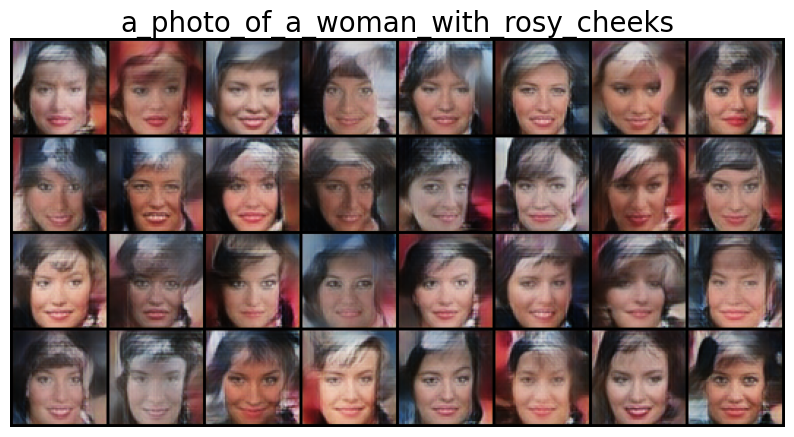

# conditional CNN-VAE

based on https://github.com/LukeDitria/CNN-VAE

### Abstract

In this project, we investigate how CLIP image embeddings can be used with Conditional Variational Autoencoders (CVAEs)
for text-to-image generation. In general, text-to-image generation systems require image and text caption pairs as
input for training. However, datasets with such labels do not exist for every domain and are expensive to obtain. As a
substitute for the text labels, we use CLIP to extract important features of the images in the form of image
embeddings. We use these embeddings as a condition for training a CVAE. At inference time, to perform text-to-image
generation, a target caption is encoded as CLIP text embeddings. The embeddings are then used as a condition in the
reparameterization step and further fed to the model's encoder to generate the corresponding image.

The results on CelebA dataset show that our model is able to perform text-to-image generation even when not trained on
caption labels, suggesting that CLIP image embeddings can encode the semantics of images. In our analysis, we
investigate what information is preserved or lost in CLIP embeddings. We also propose a method for manipulating images
through a text prompt such as “wearing glasses” that puts a pair of glasses on a given face. We release our codes at
[CVAE-Conv](https://github.com/meanna/conditional_VAE) and [CVAE-VGG19](https://github.com/meanna/conditional_VAE).

## install

- pytorch
- python 3.7
- CLIP

## datasets

- not-zoom-face: celebA cropped but still see the neck area and more background, resized to 64
- zoom-face: celebA cropped to only see the face, resized to 64
    - this gives better image generation result
    - generated by `resize_images.py`

- put the dataset to "Models" folder

## train

- load CLIP embedding file (embeddings.csv)
- go to train.py
    - set path in CelebA_CLIP
    - go to get_data_celebA_small and get_data_celebA, set dataset paths
    - go to main function and adjust
    - choose VAE model you want to use, default is line 99 - you can use "RES_VAE_conditioned.py" by importing it there
        - e.g. from RES_VAE_conditioned import VAE
    - set the parameters
        - batch_size = 128 (suggested is 256)
        - num_epoch = 10
        - dataset = "celeba"
        - latent_dim = 128 (suggested is 512)
        - load_checkpoint = None or use checkpoint name
        - run_train = True

## model architecture

### conditional VAE

- input: image tensor (batch, 3, 64, 64 ), condition tensor (batch, 512, 1, 1)
- output: tensor (batch, 3, 64, 64 )

#### VAE

- encoder: (x denotes the input tensor)
    - x -> 5 residual down sampling blocks -> x
    - mu = Conv2D(x)
    - log_var = Conv2D(x)
    - output: x, mu, log_var
- re-parametrization
    - sample from mu and log var, give out = (batch, latent, 1, 1)
    - out = out concatenated with condition, gives output of shape (batch, latent + 512, 1, 1)
- decoder
    - take the re-parametrization result as input
    - pass it into 6 residual up sampling blocks
    - and a Conv2d layer
    - return output of shape (batch, 3, 64, 64), this is the recon_data

- the output images = sigmoid(recon_data)

### loss

- loss = VAE loss + Perception loss

- VAE loss is computed using recon_data, images, mu, log_var

  ```
  def vae_loss(recon, x, mu, logvar):
      recon_loss = F.binary_cross_entropy_with_logits(recon, x)
      KL_loss = -0.5 * (1 + logvar - mu.pow(2) - logvar.exp()).mean()
      loss = recon_loss + 0.01 * KL_loss
      return loss
  ```

- Perception loss
    - is a feature_extractor(VGG19) that takes as input the recon_image and real images

### Residual blocks

- Residual down sampling block
    - x -> AvgPool2d -> Conv2D (out 1, skip)
    - x -> Conv2D -> BatchNorm2d -> rrelu -> AvgPool2d -> Conv2D -> BatchNorm2d (out2)
    - out1 + out2 - > rrelu

- Residual up sampling block
    - x -> Upsample -> Conv2d (out 1, skip)
    - x -> Conv2d -> BatchNorm2d -> rrelu -> Upsample -> Conv2d -> BatchNorm2d (out2)
    - out1 + out2 -> rrelu

## model variation

- RES_VAE0: unconditional VAE
- RES_VAE1: condition is concatenated with the input and passed into the first layer of the encoder
- RES_VAE2: condition is added to the 4th Conv-Block of the encoder
    - this is the best architecture
- RES_VAE3: condition is added to the 5th Conv-Block of the encoder
- RES_VAE4: no condition is used in the encoder, only use in re-parametrization step


- for all model, in the re-parametrization step, the output from the encoder is concatenated with the condition

## models

- best model
    - trained for 25 epochs, save model every 5 epochs (zoom-face dataset)
    - to run it, you need the model module `RES_VAE2` (RES_VAE2.py)
    - checkpoints
        - CNN_VAE_celeba_resize_2022-08-07_01.36.18_epoch4.pt
        - CNN_VAE_celeba_resize_2022-08-07_01.36.18_epoch9.pt
        - CNN_VAE_celeba_resize_2022-08-07_01.36.18_epoch14.pt
        - [CNN_VAE_celeba_resize_2022-08-07_01.36.18_epoch19.pt](https://drive.google.com/file/d/1md-1WFajLvTOjbRdVDVUzVGMt3juT1An/view?usp=sharing)
        - [CNN_VAE_celeba_resize_2022-08-07_01.36.18_epoch24.pt](https://drive.google.com/file/d/1GTFSPeR8Vla-CWlsiYxxrSiIN02hR-mS/view?usp=sharing)

- second best model (not-zoom-face)
    - `CNN_VAE_celeba_2022-08-04_23.22.32`
    - [download link](https://drive.google.com/file/d/1kJGqb7POsP6IUhoCZOwYO-YQ36VYrWvy/view?usp=sharing)
    - or `gdown https://drive.google.com/uc?id=1kJGqb7POsP6IUhoCZOwYO-YQ36VYrWvy`
    - /home/debian/home/sseeha/clip_gan/CNN_VAE/Models/model_backup
- other (not-zoom-face)
    - CNN_VAE_celeba_2022-08-05_17.20.03_epoch9.pt
    - CNN_VAE_celeba_2022-08-05_18.07.11_epoch9.pt
    - [CNN_VAE_celeba_2022-08-05_18.07.11_epoch9_epoch19](https://drive.google.com/file/d/12fghzRtzQ0KSbg4ONnTHTdXOpTUVWViq/view?usp=sharing)
        - `gdown https://drive.google.com/uc?id=12fghzRtzQ0KSbg4ONnTHTdXOpTUVWViq`
- not very good (not-zoom-face)
    - CNN_VAE_celeba_2022-08-05_17.20.03
    - CNN_VAE_celeba_2022-08-05_17.20.03_epoch9_epoch14.pt
    - CNN_VAE_celeba_2022-08-05_17.20.03_epoch9_epoch19.pt

# generation

- load a dataset (zoom-face or not-zoom-face), see what dataset the model is trained on
- load embeddings_128.csv (test set)
- put the model checkpoint to Models folder
- in final_models.py
    - load_checkpoint = "CNN_VAE_celeba_2022-08-04_23.22.32" (!without .pt)
    - run_train = False
    - set dataset = "celeba"
    - in get_data_celebA, set the path
        - E.g. if your celebA data is in `../datasets/celeba/img_align_celeba`, the set the value like below
        - also set the embeddings path

```
def get_data_celebA(transform, batch_size):

    data_root = "../datasets/celeba/"  < -------------
    training_data = CelebA_CLIP(root=data_root,
                                transform=transform,
                                image_folder="img_align_celeba", < -------------
                                clip_embeddings_csv="../conditional_VAE/src/embeddings_128.csv") < -------------
    print("dataset size", len(training_data))  # 202599
    test_size = 16
    train_size = len(training_data) - test_size
    trainset, testset = torch.utils.data.random_split(training_data, [train_size, test_size])

    trainloader = DataLoader(trainset, batch_size=batch_size, shuffle=True, num_workers=8)
    testloader = DataLoader(testset, batch_size=batch_size, shuffle=False, num_workers=8)
    print("Done load dataset")
    return trainloader, testloader, train_size
```

## functions to generate images

- call these functions in the main function of final_model.py

### functions

1. text-to-image

- takes a text and generate images according to the text
- `image_generation_clip(target_attr="wear glasses", save_folder=result_folder)`

| example            |  example |
:-------------------------:|:-------------------------:
| 
|
|
|
|

2. image-to-image

- `image_generation_clip(target_attr=None, save_folder=result_folder)`
- generate random images with condition (CLIP embeddings of some test images)


3. attribute_manipulation
    - `attribute_manipulation(target_attr="wear reading glasses", image_embed_factor=0.5)`
    - it takes some test images and a text (e.g. wearing glasses) and modify the images according to the images
    - the result would be e.g. a person wearing glasses

| example            |  example |
:-------------------------:|:-------------------------:
 | 
 | 
 | 
 | 


4. image reconstruction

- `reconstruct_images()`
- takes some images and produce the reconstruction of them


For example,

```
# 1) text-to-image
image_generation_clip(target_attr="wear glasses", save_folder=result_folder)

# 2) image-to-image
image_generation_clip(target_attr=None, save_folder=result_folder)

# 3) attribute manipulation
attribute_manipulation(target_attr="wear reading glasses", image_embed_factor=0.5, save_folder=result_folder)
plot_interpolation(target_attr="smiling", num_images=1, save_folder=result_folder)

# 4) image reconstruction
reconstruct_images(save_folder=result_folder)
```